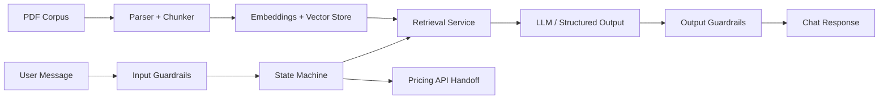

# Architecture

QuoteGuard is organized into four layers:

1. Ingestion and knowledge base
2. Retrieval
3. Conversational orchestration
4. Guardrails

## Data Flow

## Visibility

The demo UI should expose:

- current phase
- populated slots
- retrieval query and top chunks
- guardrail decisions
- handoff decisions and audit trail

The retrieval lab dashboard additionally exposes:

- parser comparison across timing stages
- document-level section and chunk counts by backend
- sample section previews for parser quality inspection
- question-level retrieval latency and top-hit comparisons
